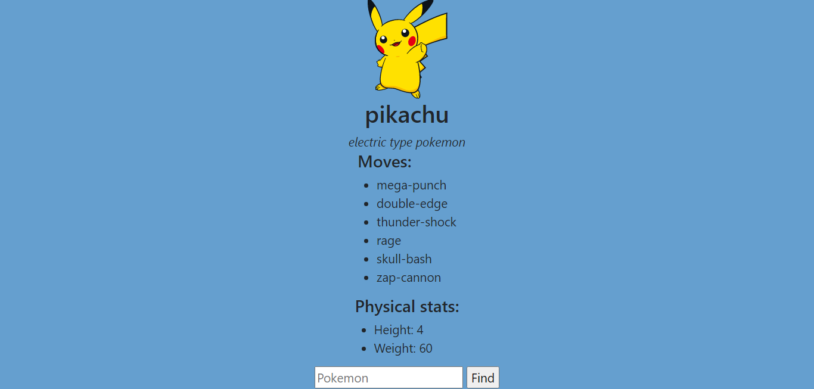

# Pokedex
Simple pokedex written with HTML, CSS and Javascript. It uses pokeapi to get pokemon's information and then displays the name, picture, moves and physical stats(height, weight) of the Pokemon.
## Link
https://frntrq.github.io/Pokedex/

